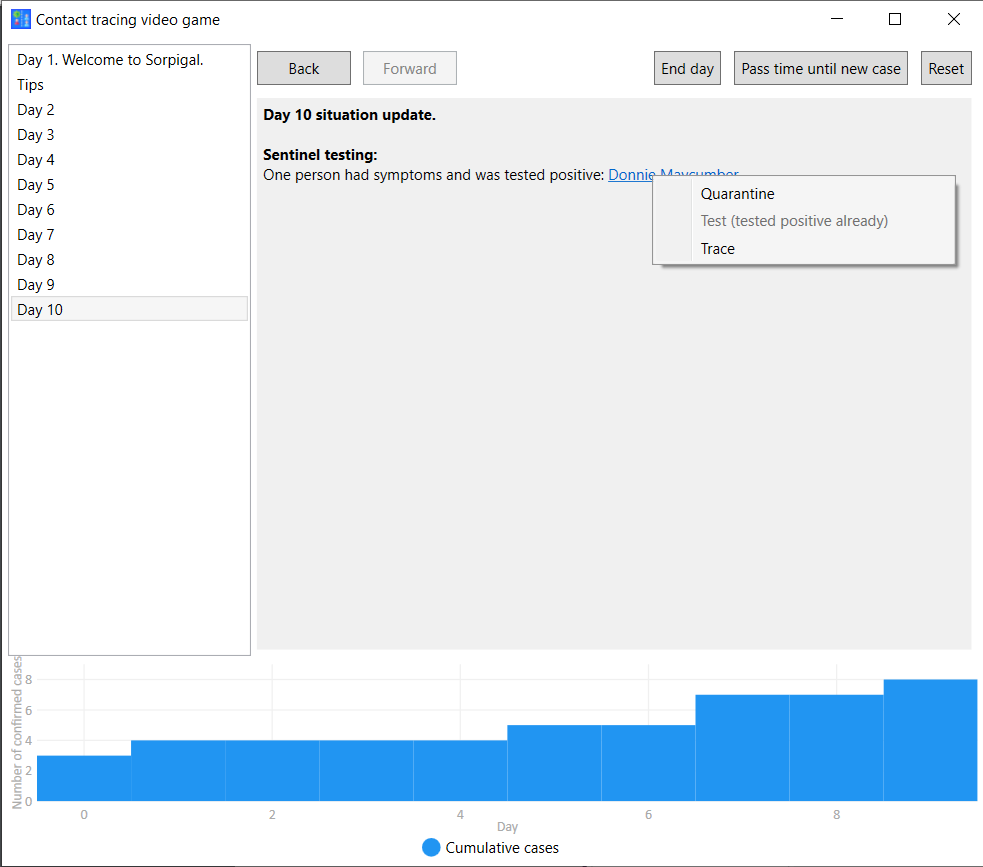

Contact tracing video game
==========================
As an epidemiologist, you must contain an outbreak of COVID-19 before it gets out of hand. You do this by reading test results, tracing contacts, and ordering quarantine and tests. You win when two full incubation periods pass without a confirmed case.

[Download the game!](https://github.com/Soothsilver/ContactTracingVideoGame/releases/download/initial-release/Contact.tracing.video.game.exe)

**Problem:** People do not like lockdowns and believe that lockdowns are the only way to suppress the epidemic. Thus, they believe the epidemic can't be suppressed long-term.

**Solution:** Create a video game that shows how you can contain an outbreak of a disease in a small town, using contact tracing. This show people in a fun way that it is possible to contain or suppress the disease without long-term lockdowns. 

**What have we done:** We created the Contact tracing video game, a Windows game where, as an epidemiologist, you must contain an outbreak of COVID-19 before it gets out of hand. You do this by reading test results, tracing contacts, and ordering quarantine and tests.

**Impact:** If people understand the value of contact tracing, they may be more willing to install contact tracing apps and also follow hygiene rules and restrictions in general, and may be less discouraged, because they have more hope.

**In order to continue the project:** All we need to do is to spread the word. The project is complete.

**Value after crisis:** None.
